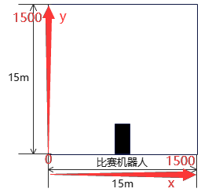
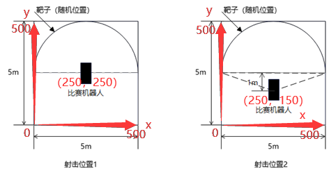

# "学以致用"大赛串口通信驱动
## 1 内容说明
移植使用 client 文件夹下的两个文件。例子参考 window_serial_example 文件夹下工程。
## 2 通信协议说明
通信协议
| 帧头 | 硬件地址 | 功能码 | 数据长度 | 数据 | 校验和 | 附加校验和 |
| ---- | ------- |---- | ----     | ---- | ---- | ----        |
| 0xAA | 0xFF    |ID 号 | length   | data | sum   | add_sum |

控制指令
|     | ID号 |
| ---- | ---- |
| 车子移动控制 | 0x01 |
| 拍照控制 | 0x02 |
| 射击控制 | 0x03 |

发馈数据
|     | ID号 |
| ---- | ---- |
| 位置 | 0x04 |
| 底盘朝向 | 0x05 |
| 云台角度 | 0x06 |

## 3 数据内容说明
### ID 0x01 车子移动指令
| 数据类型 | int16_t | int16_t | int16_t | int16_t | int16_t |
| ---- | ------- |---- | ----     | ---- | ---- | 
| 数据内容 | x | y | speed_rotate | angle_yaw | angle_pitch |

- x,y：目标 x 坐标，目标 y 坐标（范围：0 ~ 1500）。
- speed_rotate：右旋速度（暂时没用）。
- angle_yaw,angle_pitch：云台角度，向右为正，向上为正（范围：-90 ~ 90）。



### ID 0x03 射击指令
| 数据类型     | uint16_t | uint8_t |
| ---- | ------- | ------- |
| 数据内容     | speed_shoot | shoot_num |

- speed_shoot：射速 （范围：0 ~ 7（对应每秒钟摩擦轮转动的圈数））
- shoot_num：发射数。
### ID 0x04 位置信息
| 数据类型 | int16_t | int16_t |
| ---- | ------- |---- |
| 数据内容 | x | y |
### ID 0x05 底盘角度
| 数据类型 | int16_t |
| ---- | ------- |
| 数据内容 | chassis_angle |
### ID 0x06 云台角度
| 数据类型 | int16_t | int16_t |
| ---- | ------- |---- |
| 数据内容 | yaw | pitch |
## 4 使用方法
1. 接收小车反馈信息：串口每接收到一字节小车数据，调用 ANO_DT_GetOneByte 函数一次，函数参数就是串口收到的数据。
2. 发送命令：在发送命令前先对指令进行赋值，然后再调用 Frame_Send 函数发送，参数是发送指令的 ID 号。其中 Frame_Send 函数里的 USART_Send_Data 函数需要替换成发送字符串的函数，字符串为 send_buffer。
``` C
//发送发射指令
ctrl_shoot.st_data.speed_shoot = 5;
ctrl_shoot.st_data.shoot_num = 1;
Frame_Send(0x03);
//发送移动指令
ctrl_move.st_data.x = 50;
ctrl_move.st_data.y = 50;
Frame_Send(0x01);
```
3. 发送移动指令或发射指令时发送两次即可，发送频率太高会导致通信不稳定。
4. 移动指令发送成功后，机器人会直线向目标位置移动。